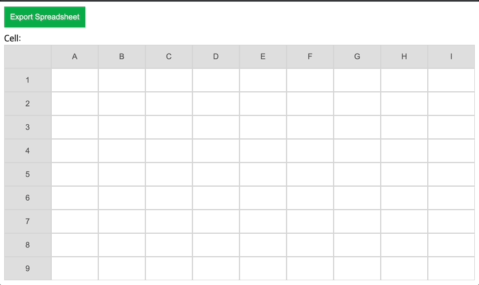

> 👉 [배포 페이지 바로가기](https://sj70.github.io/Spread_Sheet/)

# 04. 자바스크립트를 이용해서 Spread Sheet 앱 만들기

### 수행기간

● 3일

---
### 결과물

● 제출해야 하는 결과물은 아래와 같습니다.

● 아래 링크 (그림 1)의 리소스 형상(manifest)이 올라간 결과물 레포 주소 (URL 제출)

---
### 하위과제

● 위와 같이 현재 focus 된 셀의 위쪽 헤더 왼쪽 헤더가 함께 하늘색으로 하이라이트 되게 해 줍니다.

● 작성된 모든 데이터들을 Export SpreadSheet 버튼을 눌러서 Excel 파일로 생성합니다.

● 생성된 Excel 파일을 구글 Spreadsheet 에서 Import 하면 같은 데이터가 나오게 합니다.